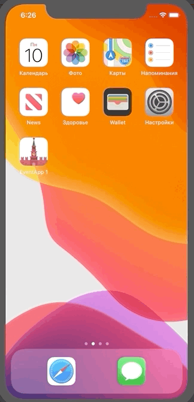

Приложение по поиску интересных мероприятий в Москве. Есть возможность сохранять события в вкладке "Избранное".
Все мероприятия разбиты на категории, так же есть функция поиска.

                

Для входа можете использовать этот аккаунт:
admin@mail.ru
123456

1. **Интерфейс** выполнен **кодом**

   ~~Storyboard~~  ~~Xib~~

2. **Архитектура**: MVC + Сетевой сервис 

3. **RootViewController** навигация выполненна через RootController

4. **URLSession**

5. **FireBase** Вход выполнен через FireBase

Избранные мероприятия так же сохраняются в Firebase

6. **JSON**

7. **Codable**

8. Внешние библиотеки отсутствуют.

9. **Multithreading**

10. **Autolayout:** Кодом. Anchors

11. **UICollection:** Отдельные и вложенные в ячейки таблицы. Кастомные ячейки

12. **UITableView**: Кастомные ячейки. Анимация загрузки.

13. Модульные тесты 
